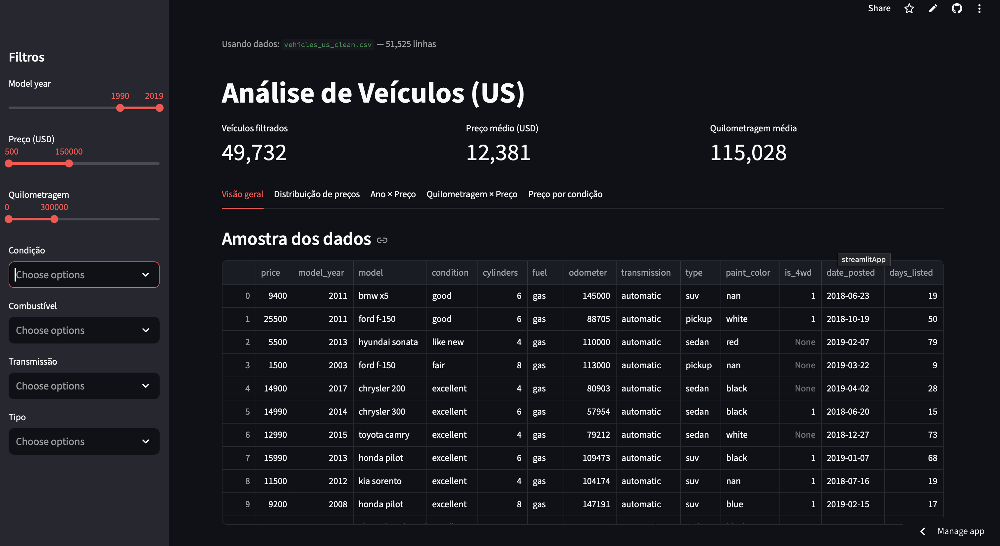

# exploratory-analysis
# 🚗 Análise Exploratória de Veículos (US)

Este projeto realiza uma análise exploratória de dados de anúncios de veículos usados nos Estados Unidos.  
O objetivo é visualizar padrões de preço, quilometragem, ano de fabricação e outras características dos veículos.

## 📊 Funcionalidades
- Upload de arquivo CSV com dados de veículos  
- Visualização de estatísticas descritivas  
- Filtros interativos (ano, preço, quilometragem, condição, combustível, transmissão, tipo)  
- Gráficos interativos construídos com **Plotly Express**  
- Aplicação web construída com **Streamlit**  

## 🚀 Deploy
O app está disponível online:  
👉 [Clique aqui para acessar o aplicativo](https://exploratory-analysis-vehicles.streamlit.app)

## 🖼️ Exemplo da aplicação  

## 📂 Estrutura do projeto
exploratory-analysis/
│– notebooks/EDA.ipynb     # Notebook com análise exploratória
│– app.py                   # Aplicação Streamlit
│– requirements.txt         # Dependências do projeto
│– vehicles_us.csv          # Base de dados original
│– vehicles_us_clean.csv    # Base de dados limpa

## ⚙️ Tecnologias utilizadas
- Python 3.11  
- Pandas  
- Plotly Express  
- Streamlit  

## 👩‍💻 Autora
Projeto desenvolvido por **Leilane Leite** no curso de Análise de Dados da TripleTen.

## Executando no Render
Este projeto foi configurado para ser executado na plataforma Render.  
Certifique-se de que o arquivo `.streamlit/config.toml` está presente no repositório antes do deploy.
